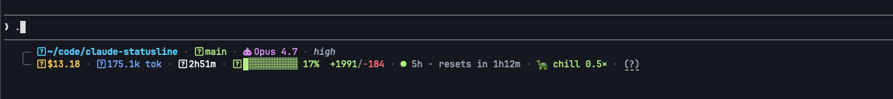

# claude-statusline

Status line de duas linhas para o [Claude Code](https://claude.com/code) — denso, colorido, com tudo que importa numa olhada: path, branch + dirty state, modelo, custo, tokens, duração, uso do context window, linhas alteradas e rate limit do plano com contagem regressiva.

**Funciona em macOS, Linux e Windows.** Sem dependências externas (sem `jq`, sem `bash` no Windows) — usa o Node que já vem com o Claude Code.



```
╭─  ~/code/projeto/src · ⎇ main +3 ~2 · 󰚩 Opus 4.7 · high
╰─  $0.42 ·  219.4k ctx · last +187 ·  18m03s ·  ███████░░░ 73%  +156/-23 · 🟢 5h · resets in 2h14m
```

---

## Instalação

### macOS / Linux

```bash
curl -fsSL https://raw.githubusercontent.com/andregosling/claude-statusline/main/install.sh | bash
```

### Windows (PowerShell)

```powershell
irm https://raw.githubusercontent.com/andregosling/claude-statusline/main/install.ps1 | iex
```

Os instaladores:

- Baixam o `statusline.js` para `~/.claude/`
- Instalam o CLI `claude-statusline` (em `~/.local/bin` no Unix, `~/.claude/bin` no Windows)
- Editam o `~/.claude/settings.json` adicionando a seção `statusLine` (faz backup)
- Avisam se você não tem uma Nerd Font instalada e se o dir do CLI não está no PATH

Depois é só recarregar o Claude Code.

---

## Auto-update

O status line se atualiza **automaticamente** depois de qualquer commit nesse repo, sem você fazer nada.

Como funciona: o renderer (`statusline.js`) roda a cada refresh do Claude Code. Ele dispara um processo Node filho em background que checa o GitHub e, se tem versão nova, sobrescreve o próprio arquivo. O render nunca espera pela rede.

O background check é disparado quando **qualquer um** destes acontece:

- **Você reinicia o Claude Code** (ou abre uma sessão nova) — detectado pelo `session_id` novo. Reiniciou → checa na hora → se desatualizado, baixa sozinho. A versão nova já roda nos próximos renders dessa mesma sessão.
- **Passaram 24h** desde o último check — cobre quem deixa o Claude Code aberto por dias sem reiniciar.

Dentro da mesma sessão, nunca checa mais de 1x por 24h — sem flood. Para forçar a qualquer momento: `claude-statusline update`.

### CLI: `claude-statusline`

```bash
claude-statusline status      # mostra versão local, versão no GitHub, último check
claude-statusline update      # força download da versão mais recente AGORA
claude-statusline explain     # explica o que cada segmento significa (no terminal)
claude-statusline version     # imprime a versão local
claude-statusline uninstall   # remove tudo e despatcheia settings.json
claude-statusline help        # ajuda
```

Você também tem um **`(?)` clicável no final da status line** — Cmd/Ctrl+click abre a [página HELP.md](./HELP.md) no GitHub. Funciona em iTerm2, WezTerm, Kitty, Windows Terminal, Ghostty. Para esconder o link: `export CLAUDE_STATUSLINE_NO_HELP=1`.

O `status` te diz se tem update disponível:

```
  local version:      2.0.0
  latest on GitHub:   2.1.0  ← update available (run: claude-statusline update)
```

Para travar na versão atual (desligar auto-update): edite `~/.claude/settings.json` e troque o command pra apontar pra uma cópia que você mantém manualmente, ou simplesmente não rode mais o CLI.

---

## Requisitos

- **Claude Code** (obviamente — ele traz o Node embutido)
- **Node** acessível no PATH (geralmente já vem com o Claude Code)
- **Uma Nerd Font** no seu terminal (opcional — sem ela, defina `CLAUDE_STATUSLINE_PLAIN=1` para usar fallbacks ASCII)

### Instalar a Nerd Font

**macOS:**
```bash
brew install --cask font-jetbrains-mono-nerd-font
```

**Windows:**
```powershell
winget install --id=DEVCOM.JetBrainsMonoNerdFont
# ou
scoop install JetBrainsMono-NF
```

**Linux:** baixe de [nerdfonts.com](https://www.nerdfonts.com/font-downloads).

Depois, configure seu terminal (Windows Terminal / iTerm2 / Terminal.app / Alacritty / WezTerm / etc.) para usar `JetBrainsMono Nerd Font` como fonte. Sem isso os ícones aparecem como quadradinhos vazios (`□`) ou caracteres aleatórios — o status line continua funcionando, só fica menos bonito.

**Modo plain ASCII (sem Nerd Font):**

```bash
export CLAUDE_STATUSLINE_PLAIN=1   # macOS/Linux
$env:CLAUDE_STATUSLINE_PLAIN = "1" # PowerShell
```

Substitui todos os glyphs de Nerd Font por equivalentes ASCII (`◆`, `+`, `↑`, etc.) — funciona em qualquer terminal.

---

## O que aparece

**Linha 1 (contexto):**

| Segmento | Exemplo | Notas |
|---|---|---|
| Path |  `~/…/projeto/src` | Colapsa para os 2 últimos segmentos quando o caminho é profundo |
| Git | `⎇ main +3 ~2 -1` | Branch + ahead/behind + added/modified/deleted. Verde quando limpo, âmbar quando dirty |
| Modelo | `󰚩 Opus 4.7` | Display name compacto |
| Effort | `high` / `med` / `low` | Só aparece se `effortLevel` estiver setado |
| Worktree | `wt:feature-x` | Só se estiver dentro de um worktree |

**Linha 2 (métricas):**

| Segmento | Exemplo | Notas |
|---|---|---|
| Custo |  `$0.42` | Total da sessão em USD |
| Tokens |  `219.4k ctx · last +187` | Tamanho do contexto agora / output do último turno (snapshots — o CC não dá total acumulado) |
| Duração |  `18m03s` | Tempo de wall-clock da sessão |
| Context |  `███████░░░ 73%` | Verde <50%, âmbar 50-79%, vermelho ≥80% |
| Linhas | `+156/-23` | Só aparece quando você editou algo |
| Rate limit 5h | 🟢 `5h · resets in 2h14m · 🚶 ok 0.9×` | Bolinha (cor = % de uso bruto) + countdown + **pace** (cor própria) |

### Bolinha vs Pace — duas métricas independentes

São **duas coisas diferentes**, com cores separadas:

**Bolinha `●`** — cor baseada **só no % de uso bruto** do limite de 5h, ignora o tempo:
- 🟢 verde — usou < 50%
- 🟡 âmbar — usou 50–79%
- 🔴 vermelho — usou ≥ 80%

Usou 5% do limite? Bolinha verde, sempre — não importa o pace.

**Pace `🏃 fast 1.5×`** — diz **quão rápido você está queimando** comparado com o tempo passando:

- **1.0×** = ritmo perfeito (zera o orçamento exatamente no reset)
- **< 1.0×** = gastando devagar, tem folga (ex: `0.5×` = metade do ritmo)
- **> 1.0×** = gastando rápido, vai bater o teto antes (ex: `2.0×` = queimando o dobro)

Buckets do pace (cor própria, separada da bolinha):

| Pace | Ícone | Cor | Significa |
|---|---|---|---|
| < 0.7× | 🐢 chill | verde | bastante folga, pode gastar à vontade |
| 0.7–1.1× | 🚶 ok | verde | no ritmo (1.0× exato cai aqui) |
| 1.1–1.5× | 🏃 fast | âmbar | acelerado, segura um pouco |
| > 1.5× | 🔥 hot | vermelho | muito acima, vai bater o teto |

**Exemplo**: usou 30% do limite em 1h dentro da janela de 5h. Pace = `0.3 ÷ 0.2 = 1.5×` → `🏃 fast 1.5×`. Tradução: nesse ritmo você bate o teto em ~3h20, então segura.

Outro: usou 60% em 4h. Pace = `0.6 ÷ 0.8 = 0.75×` → `🐢 chill 0.8×`. Tradução: tem orçamento sobrando pra última hora.

O pace só aparece depois de ~30min de janela — antes disso o número é ruído (a bolinha continua aparecendo normalmente).

---

## Customização

`statusline.js` é um único arquivo Node.js sem dependências. Edita à vontade:

```bash
$EDITOR ~/.claude/statusline.js
```

**Atenção**: se você editar localmente, o auto-update vai sobrescrever suas mudanças. Para customizar permanentemente:

1. Faça fork do repo
2. Edite seu fork
3. No `statusline.js`, mude a constante `REPO_RAW` para apontar pro seu fork

Ou simplesmente reinstale apontando pro fork.

### O que dá pra mudar fácil

No topo de `statusline.js`:

- **Cores**: objeto `C` — RGB truecolor, mude `rgb(R, G, B)`
- **Glyphs**: objeto `G` — qualquer caractere / emoji / glyph Nerd Font
- **Thresholds**: função `ctxColor()` controla quando o context bar fica âmbar (50%) e vermelho (80%)
- **Refresh**: edite `refreshInterval` em `~/.claude/settings.json` (segundos)

---

## Desinstalar

```bash
claude-statusline uninstall
```

Pede confirmação e remove o renderer, cache, CLI, e a seção `"statusLine"` do `settings.json` (com backup).

---

## Troubleshooting

**Não aparece nada (ou só aparece `main`)** — geralmente significa que `node` não está no PATH onde o Claude Code o executa. Teste:

```bash
node --version
```

Se isso falhar, instale Node (ou descubra onde o Claude Code colocou o Node embutido e ajuste o PATH).

**Os ícones aparecem como `□` ou `?`** — sua fonte de terminal não é uma Nerd Font. Veja [Requisitos](#requisitos), ou ative o modo plain:
```bash
export CLAUDE_STATUSLINE_PLAIN=1
```

**Atualização não chegou** — force agora:
```bash
claude-statusline update
```

**Quero ver o log de updates:**
```bash
cat ~/.claude/cache/claude-statusline/update.log
```

**No Windows: erro "execution policy"** — o instalador precisa rodar PowerShell scripts. Se você bloquear scripts:
```powershell
Set-ExecutionPolicy -Scope CurrentUser -ExecutionPolicy RemoteSigned
```

---

## Versões anteriores

A v1.x usava bash + jq e só funcionava em Unix. A v2.0 reescreveu tudo em Node.js para funcionar igual em macOS/Linux/Windows com zero deps externas. Se você instalou a v1.x, rode o instalador novo — ele cuida da migração.

---

## Licença

MIT — veja [LICENSE](./LICENSE).
